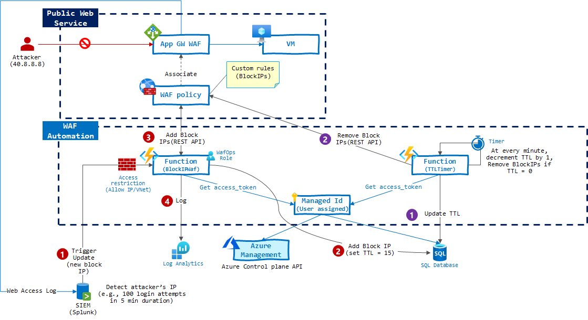

# WAF Automation

This sample demonstrates how to configure App Gateway WAF Policy via Azure Function.



## Setup test environment

> You need to prepare `user assigned identity` with right role assignment. See [RBAC](./2_RBAC) folder.

To setup test environment, run terraform script. See [terraform](./3_terraform) folder for more information.


Terraform will provision and configure as followings:

- Provision _VM_ and install NGNIX
- Provision _App GW WAF_ (Prevention mode)
- Provision _WAF Policy_ and associate this policy with App GW listeners (80, 443)
- Provision _Azure Function_ (Consumption plan and dotnet runtime)
    - Storage account is provisioned as part of _Azure Function_

## Setup Function app

You can manually create a function app at the Portal and copy the source to the Portal editor. You also can deploy using _zipdeploy_ REST API for App Service/Function.

Package function app.

```powershell
Compress-Archive -Path 4_fxapp\src\* -DestinationPath .\fxapp.zip -Force
```

Download [publish profile](https://docs.microsoft.com/en-us/visualstudio/deployment/tutorial-import-publish-settings-azure?view=vs-2019#create-the-publish-settings-file-in-azure-app-service) from function app to get user name and password.

Upload function app package using [zipdeploy.ps1](./zipdeploy.ps1) powershell.

```powershell
./zipdeploy.ps1 -username <username> -password <password> -appname <appname> -filepath fxapp.zip
```

## Add __Block IP__ to policy

For block IP test, check your IP first.

```
curl ipinfo.io
```

Update WAF policy by calling function api with new policy values.

> Policy applies within about 10 sec.

```bash
curl --location --request POST 'https://sktsecfxapp.azurewebsites.net/api/BlockIPWaf?code=..==' \
--header 'Content-Type: application/json' \
--data-raw '{
    "subscriptionid": "...",
    "resourcegroup": "...",
    "resourcename": "wafpolicy",
    "clientid": "...",
    "action": "add",
    "blockips": [
        "10.10.10.10"
    ]
}'
```

## Remove __Block IP__ to policy

To remove existing block IPs. 

```bash
curl --location --request POST 'https://sktsecfxapp.azurewebsites.net/api/BlockIPWaf?code=..==' \
--header 'Content-Type: application/json' \
--data-raw '{
    "subscriptionid": "...",
    "resourcegroup": "...",
    "resourcename": "wafpolicy",
    "clientid": "...",
    "action": "remove",
    "blockips": [
        "10.10.10.10"
    ]
}'
```
