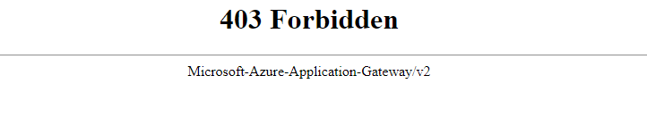

# WAF Automation

This sample demonstrates how to develop a WAF automation service (i.e., controlling Azure WAF policy via Azure Functions) for protecting your web service from brute force attack.


This automation service assumes that attacker's IP is detected and triggered by SIEM tool, such as Splunk. Any detected IPs are blocked immediately and stored in DB. Blocked IPs removed after 15 minutes.

## Setup the environment

> [Managed identity](https://docs.microsoft.com/en-us/azure/active-directory/managed-identities-azure-resources/overview) and RBAC are used for securely accessing Azure resources. That is, accessing Azure Service Management API and SQL database with no secret and least privilege. You need to prepare `user assigned identity` with right role assignment. See [RBAC](./2_RBAC) folder.

To setup demo environment, run terraform script. See [terraform](./3_terraform) folder for more information.

Terraform will provision and configure as followings:

- Provision _VM_ and install NGNIX
- Provision _App GW WAF_ (Prevention mode)
- Provision _WAF Policy_ and associate this policy with App GW listeners (80, 443)
- Provision _Azure Function_ (Consumption plan and dotnet runtime)
    - Storage account is provisioned as part of _Azure Function_
- Provision _Azure SQL Database + SQL Server_ 

## Post setup

- Setup SQL

See [database](./4_database) section for more information.

- Setup Function app

See [fxapp](./5_fxapp) section for more information.

## Test

For block IP test, check your IP first.

```
curl ipinfo.io
```

Update WAF policy by calling function api with new policy values.

```bash
curl --location --request POST 'https://fxapp.azurewebsites.net/api/BlockIPWaf?code=..==' \
--header 'Content-Type: application/json' \
--data-raw '{ "your ip" }'
```

> Policy applies within about 10 sec.

The page will be blocked as below.



